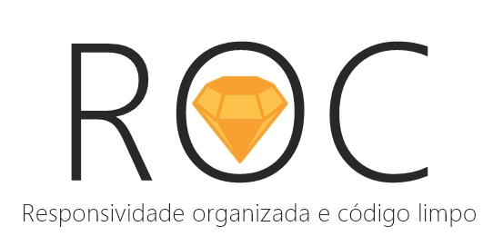

# ROC FRAMEWORK 
 
ROC é um framework que possibilita uma ampla organização em seu projeto. Feita com Stylus, CSS e usando conceitos de organização do Atomic Design ela é tudo aquilo que o desenvolvedor web precisava sem mais e nem menos, tudo na medida certa! Sua estrutura é separada em diversos arquivos que seguem a metodologia do Atomic Design e mantendo uma boa semântica em seu projeto. Se você ainda não sabe sobre está metodologia do Atomic Design é basicamente este exemplo abaixo:
 

#### Atomic Design Metodologia
<ol>
    <li>Átomos</li>
    <li>Moléculas</li>
    <li>Organismos</li>
    <li>Templates</li>
    <li>Páginas</li>
</ol>